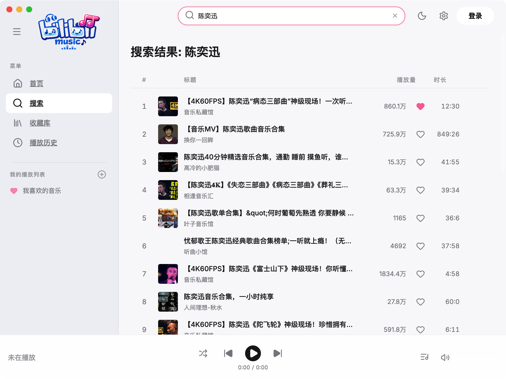

<div align="center">
  
  <h1>🎵 BiliMusic</h1>
  <p><strong>A Cross-Platform Bilibili Audio Player Built with Vibe Coding</strong></p>
  
  <p>
    <a href="#features">Features</a> • 
    <a href="#screenshots">Screenshots</a> • 
    <a href="#installation">Installation</a> • 
    <a href="#architecture">Architecture</a> 
  </p>
</div>

---

## 📖 简介

BiliMusic 是一款专为 Bilibili 音频内容设计的跨平台桌面播放器，支持 Windows 与 macOS 环境。项目全程采用 **Vibe Coding** 的范式构建，由人类开发者与 AI Agent 结对编程完成。
本工具剥离了原站的视频渲染负担，专注于提供极致的音频流体验与本地播放列表管理系统，并配备了一套基于 CSS 变量驱动的响应式亮/暗色模式 UI。

## ✨ Features

*   **🎧 全解析无缝连播**：不仅支持标准单曲解析，还专门对 B 站“多分 P 视频合集”实现了自动展开排队逻辑，无需人为干预即可平滑连播。
*   **🎨 原生级状态同步UI**：提供响应迅速的深色/浅色模式无缝热更，拥有基于高斯毛玻璃的景深图层设计，保证客户端应用的沉浸感。
*   **📡 全局检索与 B 站授权**：内嵌 B 站官方的 HTTPS 二维码扫码登录流。登录后不仅支持获取最高质量音频流，也能读取用户的推荐 feed 流与播放历史。
*   **📂 本地强隔离持久化**：应用状态、播放列表与听歌历史通过 `electron-store` 落盘在系统本地，即使换号登录也可保留本地歌单数据。
*   **💻 多平台支持能力**：基于 Electron + Vite 架构设计，支持打包发布至 Windows (`.exe`) 和 macOS (`.dmg`) 平台。

## 📸 Screenshots

| 播放主干 (Dark Mode) | 浅色引擎 (Light Mode) |
| :---: | :---: |
|  |  |

| 搜索与播放列表 | 悬浮设置与扫码流 |
| :---: | :---: |
|  |  |

## 🚀 Installation

### 常规要求
请确保本地已安装 [Node.js](https://nodejs.org/) (推荐 LTS v18+) 与包管理器。

### 1. 源码部署
```bash
git clone https://github.com/your-repo/bilimusic.git
cd bilimusic
npm install
```

### 2. 调试运行 (Dev)
```bash
npm run dev
```
此命令将拉起一个本地渲染进程服务 (Vite/React)，并挂载 Electron 主进程与自带网络代理服务，支持 HMR。

### 3. 多平台打包发布 (Build)
根据您希望分发的操作系统底盘，执行以下特定指令交接给 `electron-builder` 进行封装：

**打包至 macOS (.dmg / .app)**  
*(需在 macOS 主机环境下运行)*
```bash
npm run build && npx electron-builder --mac
```

**打包至 Windows (.exe / .nsis)**  
*(可在 Windows 或 macOS 主机环境下跨端/本端编译)*
```bash
npm run build && npx electron-builder --win
```
输出的可执行安装文件将自动投放至项目根目录下的 `release/`（Mac）或 `dist/`（部分 Win 配置）文件夹中。

## 🔐 Security & Privacy (数据与隐私安全)

BiliMusic 对于用户数据隐私持**绝对中立且隔离**的技术底线：
1. **完全的本地沙盒化**：您构建生成的所有播放列表、收藏记录、播放偏好，均通过 `electron-store` 技术**100% 留存在您的本机硬盘中**（如 `%APPDATA%` 或 `~/Library/Application Support`）。
2. **纯粹的上游通信**：应用本身没有任何专属的后台中央服务器，不存在“应用账户”体系。所有的搜索、推荐与播放请求均直接端到端发往真实的 Bilibili 官方服务器。
3. **安全的可信授权流**：登录流程完全挂载 Bilibili 官方的 Auth 会话闭环（扫码）。客户端内仅缓存维持会话所需的加密 Token/Cookie 凭证，**杜绝窃取任何隐私隐患**。应用登出后不仅彻底销毁持久化 Cookie，更有严格的本地「抹除一切数据」功能防止本机数据泄露。

## 🛣️ Architecture

本工具的技术基座立足于高容错性及高拓展性的 Node 生态栈：

- **Core Engine**: `Electron 30` + `Vite 5` + `React 18`
- **Compiler**: `TypeScript` 全量强类型约束
- **State Flow**: 自构建细粒度发布-订阅状态库 (`Zustand` 抽象逻辑)
- **Net Proxy**: 为了彻底绕过 B站反爬机制并处理 `Wbi` 鉴权、跨域限制与 `Referer` 检验，主进程中硬编码了一个基于 Socket 的透明 `localhost:48261` 音频流转发代理。
- **Styling**: 拒绝臃肿的 CSS 引擎封装，全程使用 Vanilla Native CSS 构建组件，性能开销极小。

## 📜 License

[MIT License](LICENSE) © 2026 BiliMusic Open-Source. 
This project is for educational and communication purposes only.
